# Full Technical Specification: Beto CRM (Pre-Sale)

## 1. Project Metadata
*   **Module Name**: [beto_crm](file:///home/musfikur-rahim/odoo19/betopia_group_live/beto_crm)
*   **Version**: `0.0.1`
*   **Author**: `Betopia Group (SK Meher)`
*   **Odoo Version**: 19.1 Enterprise / Community
*   **Dependencies**: [crm](file:///home/musfikur-rahim/odoo19/betopia_group_live/beto_crm), `hr`, [bd_portal](file:///home/musfikur-rahim/odoo19/betopia_group_live/bd_portal), `sale_crm`.

## 2. Core Philosophy
The module provides an **Isolated Inquiry Stage** within Odoo CRM. It allows for high-volume data entry of inquiries without contaminating the primary Sales Pipeline. Once qualified, inquiries are transitioned to the Pre-Sale Lead Pipeline.

---

## 3. Data Architecture (Optimized Schema)

### A. Extended Model: `crm.lead`
All Pre-Sale data is stored in the standard `crm.lead` table but identified by the `is_presale` flag.

| Technical Name | SQL Type | Description |
| :--- | :--- | :--- |
| `is_presale` | BOOLEAN | Primary filter for UI isolation. |
| `entry_date` | DATE | Creation date, auto-set, read-only. |
| `incoming_query_method_id` | MANY2ONE | Source method (linked to `incoming.query.method`). |
| `amount` | MONETARY | Estimated inquiry value. |
| [lead_status_id](file:///home/musfikur-rahim/odoo19/betopia_group_live/beto_crm/models/crm_lead_inherit.py#159-163) | MANY2ONE | Workflow status (linked to `lead.status`). |
| `project_category_id` | MANY2ONE | Linked to `product.template` (Master Category). |
| `platform_source_id` | MANY2ONE | Native link to `bd.platform_source`. |
| `profile_id` | MANY2ONE | Native link to `bd.profile` (Context filtered). |
| `priority` | SELECTION | 0-5 Star Rating system. |
| `job_link` | STRING | ID/URL of external job board. |
| `current_condition_id` | MANY2ONE | Project health (linked to `current.condition`). |
| [conversion_status](file:///home/musfikur-rahim/odoo19/betopia_group_live/beto_crm/models/crm_lead_inherit.py#164-168) | SELECTION | State: [query](file:///home/musfikur-rahim/odoo19/betopia_group_live/beto_crm/models/crm_lead_inherit.py#178-180) (New) or `converted` (In Pipeline). |
| `quote_link` | STRING | Raw URL for external quotes. |
| `quote_display_text` | STRING | User-friendly text for the Quote link. |
| [quote_html](file:///home/musfikur-rahim/odoo19/betopia_group_live/beto_crm/models/crm_lead_inherit.py#169-177) | HTML | Computed clickable icon link for the quote. |

### B. Configuration Models (Master Data)
1.  **`incoming.query.method`**: Stores inquiry sources.
    - Fields: `name`, `color` (Int), `sequence`.
2.  **`lead.status`**: Workflow stages.
    - Fields: `name`, `is_won_stage` (Trigger), `is_lead_pipeline` (Domain filter), `color`, `sequence`.
3.  **`current.condition`**: detailed negotiation health.
    - Fields: `name`, `color`, `sequence`.

---

## 4. Key Business Logic

### A. Stage Transition: [action_create_lead_from_query()](file:///home/musfikur-rahim/odoo19/betopia_group_live/beto_crm/models/crm_lead_inherit.py#193-205)
Changes the record's visibility and behavior:
1. Sets `type = 'opportunity'`.
2. Sets `conversion_status = 'converted'`.
3. Retains all history and notes.
4. Returns an action to open the record in the **Lead Pipeline** primary form view.

### B. Sales Integration: [_prepare_opportunity_quotation_context()](file:///home/musfikur-rahim/odoo19/betopia_group_live/beto_crm/models/crm_lead_inherit.py#181-192)
When clicking "New Quotation" from a Lead:
1. **Context Passing**: Automatically passes `platform_source_id` and `profile_id` to the Sale Order form.
2. **Product Auto-Fill**: Injects the `project_category_id` (treated as a Product Template) as the first line item on the Quotation.

### C. Automated WON status
An [onchange](file:///home/musfikur-rahim/odoo19/betopia_group_live/bd_portal/models/sale.py#577-582) or [write](file:///home/musfikur-rahim/odoo19/betopia_group_live/beto_crm/models/crm_lead_inherit.py#220-227) logic (depending on config) ensures that if a record is moved to a status where `is_won_stage == True`, the system calls Odoo's native `action_set_won()` to update global KPIs and reporting metrics.

---

## 5. UI/UX Design System

### A. Stage Isolation (Domains)
- **Standard CRM**: Filtered via `[('is_presale', '!=', True)]`.
- **Pre-Sale Query**: Filtered via `[('is_presale', '=', True), ('conversion_status', '=', 'query')]`.
- **Pre-Sale Pipeline**: Filtered via `[('is_presale', '=', True), ('conversion_status', '=', 'converted')]`.

### B. View Definitions
- **Form Views**: Uses `mode="primary"` to create fresh, clean layouts without the noise of the standard CRM chatter/stat buttons.
- **Widgets**:
  - `priority`: 5-star rating system (Read-only in lists).
  - `badge`: Color-coded status and method badges.
  - `monetary`: Dynamic currency formatting.

---

## 6. Security & ACL
- **Staff Access**: Limited to data entry and workflow execution.
- **Manager Access**: Full access to the **Pre Sale Configuration** menu under CRM Settings to manage Statuses and Methods.
- **Audit History**: Fully integrated with Odoo's standard `mail.tracking.value` system. Every change to a sensitive field (Amount, Status, Owner) is recorded in the chatter.
- 

## 7. Mandatory Field Matrix
| Stage | Fields |
| :--- | :--- |
| **All Stages** | Client Name, Job Link, Status, Category. |
| **Query Only** | Method, Amount. |
| **Pipeline Only** | Platform Source, Profile, Current Condition. |

---
# Beto CRM: Final Database Schema (ERD)

This diagram reflects the **final database column names** and relationships implemented in the [beto_crm](file:///home/musfikur-rahim/odoo19/betopia_group_live/beto_crm) module. All custom fields follow clean naming conventions (snake_case, no `x_`) and leverage Odoo's native capabilities.

```mermaid
erDiagram
    %% --- CORE WORKFLOW TABLES (Shared crm_lead table) ---
    IncomingQuery {
        integer id PK "id"
        date entry_date "entry_date (Auto)"
        integer user_id FK "user_id (Read-only)"
        integer incoming_query_method_id FK "incoming_query_method_id (Required)"
        integer partner_id FK "partner_id (Required)"
        float amount "amount (Required)"
        integer lead_status_id FK "lead_status_id (Required)"
        integer project_category_id FK "project_category_id (Required)"
        string quote_link "quote_link"
        string quote_display_text "quote_display_text"
        text note "note"
        string job_link "job_link (Required)"
        string conversion_status "conversion_status ('query','converted')"
    }

    LeadPipeline {
        integer id PK "id"
        date entry_date "entry_date"
        integer platform_source_id FK "platform_source_id (Required)"
        integer profile_id FK "profile_id (Required)"
        string job_link "job_link (Required)"
        string meeting_link "meeting_link"
        string quote_link "quote_link"
        selection priority "priority (0-5 Stars, Read-only in list)"
        integer lead_status_id FK "lead_status_id"
        integer current_condition_id FK "current_condition_id (Required)"
        integer user_id FK "user_id"
        integer partner_id FK "partner_id (Required)"
        text note "note"
    }

    %% --- TRACKING & HISTORY ---
    AuditHistory {
        integer id PK "id"
        text old_value "mail_tracking_value.old_value"
        text new_value "mail_tracking_value.new_value"
        integer user_id FK "res_users"
        datetime create_date "create_date"
        integer res_id FK "Record ID (crm_lead)"
    }

    %% --- CONFIGURATION / MASTER DATA ---
    IncomingQueryMethod {
        integer id PK "id"
        string name "name"
        integer method_color "method_color (HEX)"
    }

    ProjectCategory {
        string _origin "product.template"
    }

    LeadStatus {
        integer id PK "id"
        string name "name"
        boolean is_won_stage "is_won_stage"
        boolean is_lead_pipeline "is_lead_pipeline"
        integer status_color "status_color (HEX)"
    }

    PlatformSource {
        string _origin "bd.platform_source"
    }

    Profile {
        string _origin "bd.profile"
    }

    CurrentCondition {
        integer id PK "id"
        string name "name"
        integer condition_color "condition_color (HEX)"
    }

    %% --- RELATIONSHIPS ---
    IncomingQuery ||--o{ AuditHistory : "tracked by"
    LeadPipeline ||--o{ AuditHistory : "tracked by"
    
    IncomingQuery }|--|| IncomingQueryMethod : "method_id"
    IncomingQuery }|--|| LeadStatus : "status_id"
    IncomingQuery }|--|| ProjectCategory : "category_id"
    
    LeadPipeline }|--|| LeadStatus : "status_id"
    LeadPipeline }|--|| CurrentCondition : "condition_id"
    LeadPipeline }|--|| PlatformSource : "platform_source_id"
    LeadPipeline }|--|| Profile : "profile_id"
```

### Technical Implementation Details
1.  **Unified Model**: Both stages share the `crm.lead` table. Isolation is handled by the `is_presale` boolean field.
2.  **Field Optimization**: Removed all `x_` prefixes. Custom fields like `entry_date`, [conversion_status](file:///home/musfikur-rahim/odoo19/betopia_group_live/beto_crm/models/crm_lead_inherit.py#164-168), and `platform_source_id` are now first-class database columns.
3.  **Data Integrity**: 
    - **Required Fields**: Enforced at the view level for both stages to ensure data completeness.
    - **Dynamic Filtering**: `Profile` is filtered based on the selected `Platform Source`.
4.  **Workflow Sync**: Converting a Query to a Lead preserves all data and updates the [conversion_status](file:///home/musfikur-rahim/odoo19/betopia_group_live/beto_crm/models/crm_lead_inherit.py#164-168) to ensure clear reporting.
5.  **Audit Trail**: Leverages Odoo's native Email Thread/Tracking system for the `AuditHistory` requirement.

**Author**: Betopia Group (SK Meher)
**Version**: 0.0.1
**Document Status**: Finalized
**Maintenance**: Betopia Group
